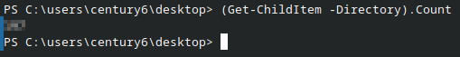
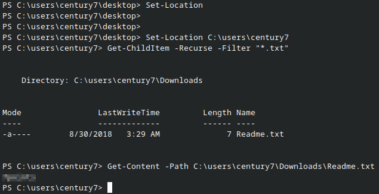
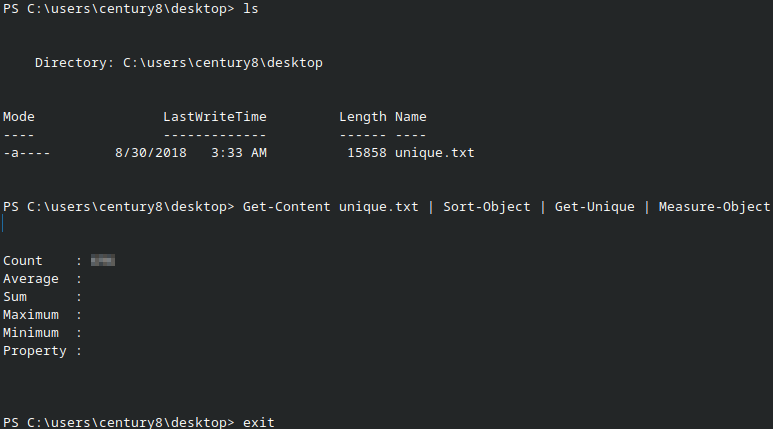
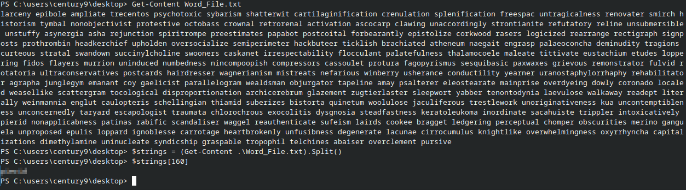
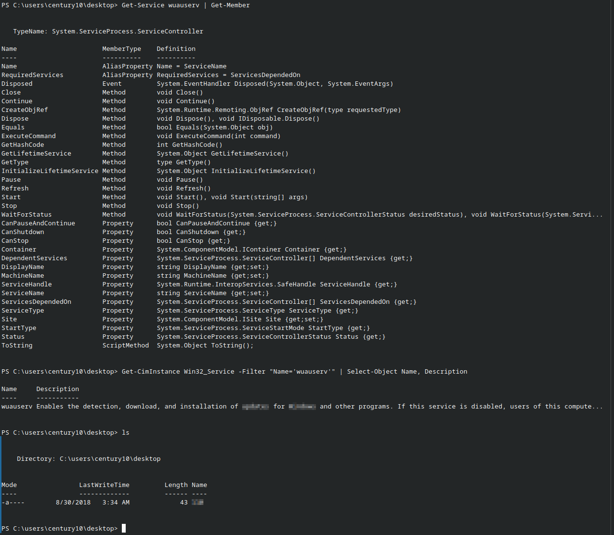

# Level 6  

#### Host:
`ssh century6@century.underthewire.tech`

### Description & Objective:
>The password for Century7 is the number of folders on the desktop.
### Solution:
> I used my knowledge of `Get-ChildItem` and the `.Count` property gained in previous levels, specifying that only directories should be counted by using the `-Directory` parameter.

### Commands&Outpust:

```powershell
(Get-ChildItem -Directory).Count
```




---

# Level 7 

#### Host:
`ssh century7@century.underthewire.tech`

### Description & Objective:
> The password for Century8 is in a readme file somewhere within the contacts, desktop, documents, downloads, favorites, music, or videos folder in the user’s profile.
### Solution

To solve this section, I needed to run a recursive search across the user folders to find the specified readme file. I assumed it would be a `.txt` file, so I ran a command filtering the results by that extension. Then, I used `Get-Content` with the specified path to view the file's contents.

### Commands&Outpust:

```powershell
Set-Location C:\users\century7
```

```powershell
Get-ChildItem -Recurse -Filter "*.txt"
```

```powershell
Get-Content -Path C:\users\century7\Downloads\Readme.txt
```



---


# Level 8  

#### Host:
`ssh century8@century.underthewire.tech`

### Description & Objective:
> The password for Century9 is the number of unique entries within the file on the desktop.
### Solution:
  
The solution is to locate the `.txt` file on the desktop that contains the entries and parse its contents using `Get-Content`. The output is then processed through `Sort-Object` and `Get-Unique` to identify unique entries, and finally counted using `Measure-Object`.

### Commands & Outpust:

```powershell
ls
```

```powershell
Get-Content unique.txt | Sort-Object | Get-Unique | Measure-Object
```



---


# Level 9 

#### Host:
`ssh century9@century.underthewire.tech`

### Description & Objective:
> The password for Century10 is the 161st word within the file on the desktop.
### Solution:
  
Here I needed to think a bit. The file on the desktop contains a large number of unsorted words, and the goal is to find the 161st one. Counting them manually was not practical, so I decided to store the words in a structure that would allow easy indexing.

The first solution that came to mind was creating an array. I created an array named `$strings` and populated it using `Get-Content`, splitting the words with the `.Split()` method. After creating the array, the only step left was to retrieve the 161st word. Since array indexing starts at 0, the correct index is `160`.

### Commands & Outpust:

```powershell
$strings = (Get-Content .\Word_File.txt).Split()
```

```powershell
$strings[160]
```
-


---


# Level 10  

#### Host:
`ssh century10@century.underthewire.tech`

### Description&Objective:
> The password for Century11 is the 10th and 8th word of the Windows Update service description combined PLUS the name of the file on the desktop.

### Solution:
>Another level that required some deeper thinking. Using `Get-Service` and `Get-Member` didn’t cut it because there was no description of the service I needed to progress, so I began searching for other cmdlets that could help me.
>
>While searching through the Microsoft Docs, I read that `Win32_Service` should contain the properties I was looking for. That gave me a hint about what the command I was supposed to execute should look like. First, I would need to retrieve data from the CIM/WMI classes, then filter it by the actual Windows Update service name `wuauserv`, select the correct object, and finally display the description.
  
### Commands&Outpust:



---

#### References:
- [Microsoft Docs](https://learn.microsoft.com/en-us/powershell/module/microsoft.powershell.management/get-childitem?view=powershell-7.5) & [PowerShellFAQs](https://powershellfaqs.com/find-file-by-name-in-powershell/) – knowledge about the `Get-ChildItem` cmdlet. 
- [Microsoft Docs](https://learn.microsoft.com/en-us/powershell/module/microsoft.powershell.management/get-content?view=powershell-7.5) – knowledge about the `Get-Content` cmdlet.
- [PowerShellFAQs](https://powershellfaqs.com/change-directory-in-powershell/) – guidance on moving between directories in PowerShell.
- [Microsoft Docs](https://learn.microsoft.com/en-us/powershell/module/microsoft.powershell.utility/get-unique?view=powershell-7.5) - knowledge about the `Get-Unique` cmdlet.
- [Microsoft Docs](https://learn.microsoft.com/en-us/powershell/module/microsoft.powershell.utility/sort-object?view=powershell-7.5) - knowledge about the `Sort-object` cmdlet.
- [Microsoft Docs](https://learn.microsoft.com/en-us/powershell/module/microsoft.powershell.utility/measure-object?view=powershell-7.5) - knowledge about the `Measure-Object` cmdlet.
- [Microsoft Docs](https://learn.microsoft.com/en-us/powershell/module/microsoft.powershell.management/get-service?view=powershell-7.5) - knowledge about the `Get-Service` cmdlet.
- [Microsoft Docs](https://learn.microsoft.com/en-us/powershell/module/cimcmdlets/get-ciminstance?view=powershell-7.5) - knowledge about the `Get-Member` cmdlet.
- [Microsoft Docs](https://learn.microsoft.com/en-us/windows/win32/cimwin32prov/win32-service)  - knowledge about Win32_Service class.
- [Microsoft Docs](https://learn.microsoft.com/en-us/powershell/module/cimcmdlets/get-ciminstance?view=powershell-7.5) - knowledge  about the `Get-CimInstance` cmdlet.
