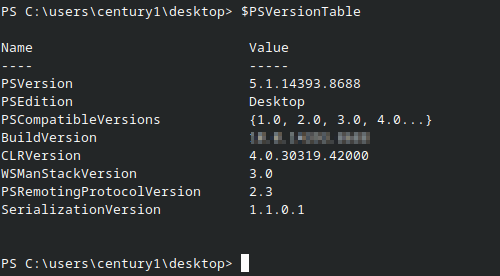
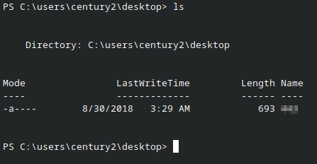
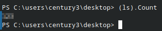
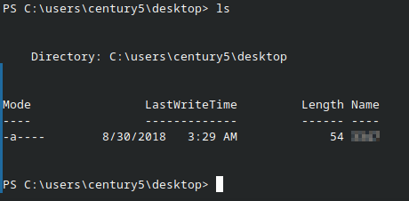
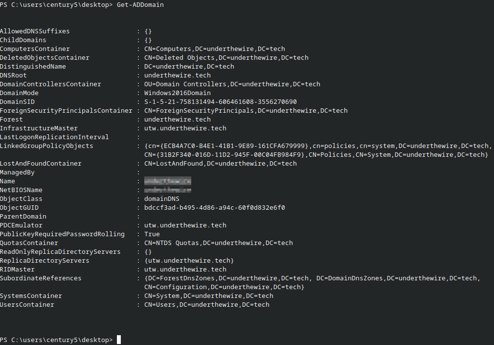

# Level 0  
 
**Host:**  
`century0@century.underthewire.tech`

### Description&Objective:
The goal of this level is to log into the game.

### Solution  
Log into the SSH session using the password provided in the **UnderTheWire Slack channel**.

##### Password:
`century1`

---

# Level 1

**Host:**  
`century1@century.underthewire.tech`

### Description & Objective:
> The password for **Century2** is the build version of the instance of **PowerShell** installed on this system.  

### Solution
> Looked up how to check the installed PowerShell version and verified it by running the appropriate command in the PowerShell terminal.

### Commands & Output:

```powershell  
$PSVersionTable  
```



---

## Level 2

**Host:**  
`century2@century.underthewire.tech`

### Description & Objective:
> The password for Century3 is the name of the built-in cmdlet that performs the wget like function within PowerShell PLUS the name of the file on the desktop.

### Solution
> Researched how to list files in the current directory using a PowerShell command. After identifying the file name, I added it at the end of the Invoke-WebRequest command (which is the PowerShell equivalent of wget), to create the password for the next level.
  
### Commands & Output:

```powershell
Invoke-WebRequest
```

```powershell  
Get-ChildItem  
```


---

## Level 3

**Host:**  
`century3@century.underthewire.tech`

### Description & Objective:
> The password for Century4 is the number of files on the desktop.

### Solution
> 

### Commands & Output:
```powershell
Get-ChildItem -File | Measure-Object | Select-Object -ExpandProperty Count
```

Short, console style version:
```powershell
(ls).Count
```



## Level 4

**Host:**  
`century4@century.underthewire.tech`

### Description  
The password for Century5 is the name of the file within a directory on the desktop that has spaces in its name.

### Solution
> 

### Commands & Output:

```powershell
Get-ChildItem -Path "C:\users\century4\desktop\Can You Open Me"
```

![Level4(Screenshots/century4.png)

---

## Level 5

**Host:**  
`century5@century.underthewire.tech`

### Description & Objective:
> The password for Century6 is the short name of the domain in which this system resides in PLUS the name of the file on the desktop.

### Solution
> Used Get-Command to search for a query that might reference the domain name I was looking for, then listed the files using the shortened version of Get-ChildItem.

### Commands & Output:

```powershell
Get-ADDomain
```


```powershell
ls
```


---

# Personal Thoughts:


#### Sources:

